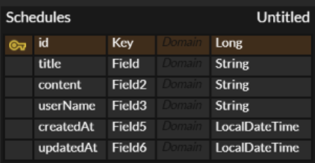

## API 명세서

| Method | URL                     | 기능       |
|--------|-------------------------|----------|
| POST   | /schedules              | 일정 생성    |
| GET    | /schedules/{scheduleId} | 일정 단건 조회 |
| GET    | /schedules              | 일정 목록 조회 |
| PATCH  | /schedules/{scheduleId} | 일정 수정    |
| DELETE | /schedules/{scheduleId} | 일정 삭제    |

### 일정 생성
- Method : POST
- URL : /schedules

#### Request
```json
{
  "title" : "일정 제목",
  "userName" : "작성자명",
  "content" : "일정 내용"
}
```
#### Response
```json
{
  "id" : 1,
  "title" : "일정 제목",
  "userName" : "작성자명",
  "content" : "일정 내용",
  "createdAt" : "2026-04-10T14:30:00",
  "updatedAt" : "2026-04-10T14:30:00"
}
```

### 일정 단건 조회
- Method : GET
- URL : /schedules/{scheduleId}
- Path Variable : scheduleId

#### Response (200 OK)
```json
{
  "id" : 1,
  "title" : "일정 제목",
  "userName" : "작성자명",
  "content" : "일정 내용",
  "createdAt" : "2026-04-10T14:30:00",
  "updatedAt" : "2026-04-10T14:30:00"
}
```

### 일정 목록 조회
- Method : GET
- URL : /schedules

#### Response (200 OK)
```json
[
  {
    "id" : 1,
    "title" : "일정 제목",
    "userName" : "작성자명",
    "content" : "일정 내용",
    "createdAt" : "2026-04-10T14:30:00",
    "updatedAt" : "2026-04-10T14:30:00"
  }
]
```

### 일정 수정
- Method : PATCH
- URL : /scedules/{scheduleId}
- Path Variable : scheduleId

#### Request
```json
{
  "title" : "일정 제목",
  "userName" : "작성자명"
}
```

#### Response (200 OK)
```json
{
  "id" : 1,
  "title" : "일정 제목",
  "userName" : "작성자명",
  "content" : "일정 내용",
  "createdAt" : "2026-04-10T14:30:00",
  "updatedAt" : "2026-04-10T14:30:00"
}
```

### 일정 삭제 
- Method : DELETE
- URL : /schedules/{scheduleId}
- Path Variable : scheduleId

#### Response (204 No Content)

### ERD
