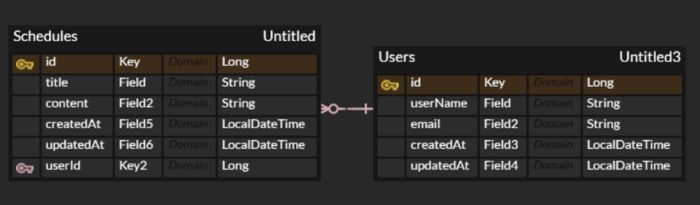

## API 명세서
<details>

<summary> 일정 API</summary>

| Method | URL                     | 기능       |
|--------|-------------------------|----------|
| POST   | /schedules              | 일정 생성    |
| GET    | /schedules/{scheduleId} | 일정 단건 조회 |
| GET    | /schedules              | 일정 목록 조회 |
| PUT    | /schedules/{scheduleId} | 일정 수정    |
| DELETE | /schedules/{scheduleId} | 일정 삭제    |

### 일정 생성
- Method : POST
- URL : /schedules

#### Request
```json
{
  "title" : "일정 제목",
  "userName" : "작성자명",
  "content" : "일정 내용"
}
```
#### Response (201 Created)
```json
{
  "id" : 1,
  "title" : "일정 제목",
  "userName" : "작성자명",
  "content" : "일정 내용",
  "createdAt" : "2026-04-10T14:30:00",
  "updatedAt" : "2026-04-10T14:30:00"
}
```

### 일정 단건 조회
- Method : GET
- URL : /schedules/{scheduleId}
- Path Variable : scheduleId

#### Response (200 OK)
```json
{
  "id" : 1,
  "title" : "일정 제목",
  "userName" : "작성자명",
  "content" : "일정 내용",
  "createdAt" : "2026-04-10T14:30:00",
  "updatedAt" : "2026-04-10T14:30:00"
}
```

### 일정 목록 조회
- Method : GET
- URL : /schedules

#### Response (200 OK)
```json
[
  {
    "id" : 1,
    "title" : "일정 제목",
    "userName" : "작성자명",
    "content" : "일정 내용",
    "createdAt" : "2026-04-10T14:30:00",
    "updatedAt" : "2026-04-10T14:30:00"
  }
]
```

### 일정 수정
- Method : PUT
- URL : /scedules/{scheduleId}
- Path Variable : scheduleId

#### Request
```json
{
  "title" : "일정 제목",
  "userName" : "작성자명",
  "content" : "일정 내용"
}
```

#### Response (200 OK)
```json
{
  "id" : 1,
  "title" : "일정 제목",
  "userName" : "작성자명",
  "content" : "일정 내용",
  "createdAt" : "2026-04-10T14:30:00",
  "updatedAt" : "2026-04-10T14:30:00"
}
```

### 일정 삭제 
- Method : DELETE
- URL : /schedules/{scheduleId}
- Path Variable : scheduleId

#### Response (204 No Content)
</details>

<details>
<summary> 유저 API </summary>

| Method | URL             | 기능       |
|--------|-----------------|----------|
| POST   | /users          | 유저 생성    |
| GET    | /users/{userId} | 유저 단일 조회 |
| GET    | /users          | 유저 목록 조회 |
| PUT    | /users/{userId} | 유저 수정    |
| DELETE | /users/{userId} | 유저 삭제    |

### 유저 생성
- Method : POST
- URL : /users

#### Request
```json
{
  "userName" : "유저명",
  "email" : "이메일"
}
```

#### Response (201 Created)
```json
{
  "id" : 1,
  "userName" : "유저명",
  "email" : "abc@gmail.com",
  "createdAt" : "2026-04-10T14:30:00",
  "updatedAt" : "2026-04-10T14:30:00"
}
```

### 유저 단건 조회
- Method : GET
- URL : /users/{userId}
- Path Variable : userId

#### Response (200 OK)
```json
{
  "id" : 1,
  "userName" : "유저명",
  "email" : "abc@gmail.com",
  "createdAt" : "2026-04-10T14:30:00",
  "updatedAt" : "2026-04-10T14:30:00"
}
```

### 유저 목록 조회
- Method : GET
- URL : /users/{userId}

#### Response (200 OK)
```json
[
  {
    "id" : 1,
    "userName" : "유저명",
    "email" : "abc@gmail.com",
    "createdAt" : "2026-04-10T14:30:00",
    "updatedAt" : "2026-04-10T14:30:00"
  }
]
```

### 유저 수정
- Method : PUT
- URL : /users/{userId}
- Path Variable : userId

#### Request
```json
{
  "userName" : "유저명",
  "email" : "이메일"
}
```

#### Response (200 OK)
```json
{
    "id" : 1,
    "userName" : "유저명",
    "email" : "abc@gmail.com",
    "createdAt" : "2026-04-10T14:30:00",
    "updatedAt" : "2026-04-10T14:30:00"
  }
```

### 유저 삭제
- Method : DELETE
- URL : /users/{userId}
- Path Variable : userId

#### Response (204 No Content)

</details>

### ERD
