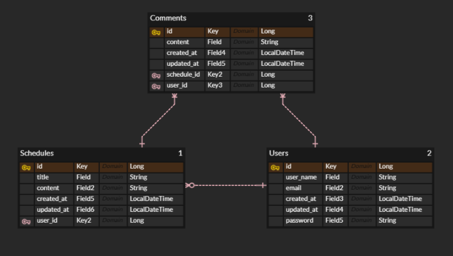

## API 명세서
<details>

<summary> 일정 API</summary>

| Method | URL                     | 기능       |
|--------|-------------------------|----------|
| POST   | /schedules              | 일정 생성    |
| GET    | /schedules/{scheduleId} | 일정 단건 조회 |
| GET    | /schedules              | 일정 목록 조회 |
| PUT    | /schedules/{scheduleId} | 일정 수정    |
| DELETE | /schedules/{scheduleId} | 일정 삭제    |

### 일정 생성
- Method : POST
- URL : /schedules

#### Request
```json
{
  "title" : "일정 제목",
  "content" : "일정 내용"
}
```
#### Response (201 Created)
```json
{
  "id" : 1,
  "title" : "일정 제목",
  "userId" : 1,
  "content" : "일정 내용",
  "createdAt" : "2026-04-10T14:30:00",
  "updatedAt" : "2026-04-10T14:30:00"
}
```

### 일정 단건 조회
- Method : GET
- URL : /schedules/{scheduleId}
- Path Variable : scheduleId

#### Response (200 OK)
```json
{
  "id" : 1,
  "title" : "일정 제목",
  "userId" : "1",
  "content" : "일정 내용",
  "createdAt" : "2026-04-10T14:30:00",
  "updatedAt" : "2026-04-10T14:30:00"
}
```

### 일정 목록 조회
- Method : GET
- URL : /schedules

#### Response (200 OK)
```json
[
  {
    "id" : 1,
    "title" : "일정 제목",
    "userId" : 1,
    "content" : "일정 내용",
    "createdAt" : "2026-04-10T14:30:00",
    "updatedAt" : "2026-04-10T14:30:00"
  }
]
```

### 일정 수정
- Method : PUT
- URL : /schedules/{scheduleId}
- Path Variable : scheduleId

#### Request
```json
{
  "title" : "일정 제목",
  "content" : "일정 내용"
}
```

#### Response (200 OK)
```json
{
  "id" : 1,
  "title" : "일정 제목",
  "userId" : 1,
  "content" : "일정 내용",
  "createdAt" : "2026-04-10T14:30:00",
  "updatedAt" : "2026-04-10T14:30:00"
}
```

### 일정 삭제 
- Method : DELETE
- URL : /schedules/{scheduleId}
- Path Variable : scheduleId

#### Response (204 No Content)
</details>

<details>
<summary> 유저 API </summary>

| Method | URL             | 기능       |
|--------|-----------------|----------|
| POST   | /users          | 유저 생성    |
| GET    | /users/{userId} | 유저 단일 조회 |
| GET    | /users          | 유저 목록 조회 |
| PUT    | /users/{userId} | 유저 수정    |
| DELETE | /users/{userId} | 유저 삭제    |

### 유저 생성
- Method : POST
- URL : /users

#### Request
```json
{
  "userName" : "유저명",
  "email" : "이메일"
}
```

#### Response (201 Created)
```json
{
  "id" : 1,
  "userName" : "유저명",
  "email" : "abc@gmail.com",
  "createdAt" : "2026-04-10T14:30:00",
  "updatedAt" : "2026-04-10T14:30:00"
}
```

### 유저 단건 조회
- Method : GET
- URL : /users/{userId}
- Path Variable : userId

#### Response (200 OK)
```json
{
  "id" : 1,
  "userName" : "유저명",
  "email" : "abc@gmail.com",
  "createdAt" : "2026-04-10T14:30:00",
  "updatedAt" : "2026-04-10T14:30:00"
}
```

### 유저 목록 조회
- Method : GET
- URL : /users/{userId}

#### Response (200 OK)
```json
[
  {
    "id" : 1,
    "userName" : "유저명",
    "email" : "abc@gmail.com",
    "createdAt" : "2026-04-10T14:30:00",
    "updatedAt" : "2026-04-10T14:30:00"
  }
]
```

### 유저 수정
- Method : PUT
- URL : /users/{userId}
- Path Variable : userId

#### Request
```json
{
  "userName" : "유저명",
  "email" : "이메일"
}
```

#### Response (200 OK)
```json
{
    "id" : 1,
    "userName" : "유저명",
    "email" : "abc@gmail.com",
    "createdAt" : "2026-04-10T14:30:00",
    "updatedAt" : "2026-04-10T14:30:00"
  }
```

### 유저 삭제
- Method : DELETE
- URL : /users/{userId}
- Path Variable : userId

#### Response (204 No Content)

</details>

<details>

<summary> 댓글 API</summary>

| Method | URL                              | 기능       |
|--------|----------------------------------|----------|
| POST   | /schedules/{scheduleId}/comments | 댓글 생성    |
| GET    | /schedules/{scheduleId}/comments | 댓글 목록 조회 |

### 댓글 생성
- Method : POST
- URL : /schedules/{scheduleId}/comments

#### Request
```json
{
  "content" : "댓글 내용"
}
```
#### Response (201 Created)
```json
{
  "id" : 1,
  "scheduleId" : 1,
  "userId" : 1,
  "content" : "댓글 내용",
  "createdAt" : "2026-04-10T14:30:00",
  "updatedAt" : "2026-04-10T14:30:00"
}
```
### 댓글 목록 조회
- Method : GET
- URL : /schedules/{scheduleId}/comments

#### Response (200 OK)
```json
[
  {
    "id" : 1,
    "scheduleId" : 1,
    "userId" : 1,
    "content" : "댓글 내용",
    "createdAt" : "2026-04-10T14:30:00",
    "updatedAt" : "2026-04-10T14:30:00"
  }
]
```

### 댓글 수정
- Method : PUT
- URL : /schedules/{scheduleId}/comments/{commentId}
- Path Variable : commentId

#### Request
```json
{
  "content" : "댓글 내용"
}
```

#### Response (200 OK)
```json
{
  "id" : 1,
  "scheduleId" : 1,
  "userId" : 1,
  "content" : "댓글 내용",
  "createdAt" : "2026-04-10T14:30:00",
  "updatedAt" : "2026-04-10T14:30:00"
}
```

### 댓글 삭제
- Method : DELETE
- URL : /schedules/{scheduleId}/comments/{commentId}
- Path Variable : commentId

#### Response (204 No Content)

</details>

## 예외 처리
| 상태코드 | 예외 상황 | 메시지 예시 |
|---------|----------|------------|
| 400 Bad Request | 잘못된 요청 값 | 제목은 3자 이상 30자 이하여야 합니다. |
| 400 Bad Request | 비밀번호 불일치 | 비밀번호가 틀렸습니다. |
| 401 Unauthorized | 로그인하지 않은 사용자 | 로그인이 필요합니다. |
| 403 Forbidden | 권한 없는 사용자 | 본인만 수정 가능합니다. |
| 404 Not Found | 존재하지 않는 유저 | 없는 유저입니다. |
| 404 Not Found | 존재하지 않는 일정 | 없는 일정입니다. |
| 404 Not Found | 존재하지 않는 댓글 | 없는 댓글입니다. |
| 409 Conflict | 중복 이메일 | 중복된 이메일입니다. |

### ERD
